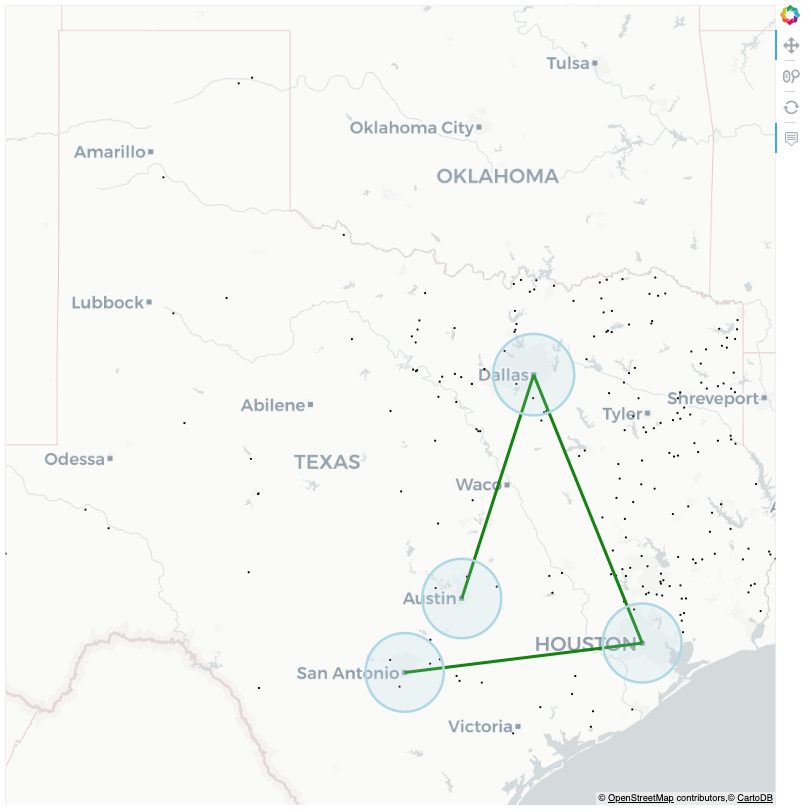
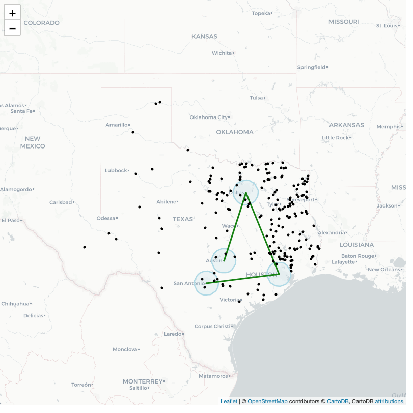

# Map Maker

Simple maps from the command line.

 [](https://coveralls.io/github/ExpediaGroup/map-maker?branch=main)

## API Docs

[TODO]()

## Installation

Installation is simple: install with `pip` (or `pip3` depending on your setup)

```
 pip install map_maker
```

## Quickstart

To test, run the following command (in the cloned repository):

```
map_maker data/bigfoot_sightings.csv data/texas_cities.csv
```

After it runs, a browser opens with a map of Bigfoot sightings in Texas, along with some polygons and lines around major metropolitan areas.



By default map maker uses Bokeh as a backend.
To see the same map with Folium / Leaflet, run this command:

```
map_maker data/bigfoot_sightings.csv data/texas_cities.csv --backend folium
```



In the project directory you'll see a file `map.html` - this is the map file.

## How to Use - Command Line

As of right now, the data must be in csv format with the following fields:

| name  | type     | description                                                                                                                              |
| ----- | -------- | ---------------------------------------------------------------------------------------------------------------------------------------- |
| shape | string   | A shape encoded as WKT or GeoJSON in EPSG:4326 lon/lat coordinates.                                                                      |
| color | string   | The color for the shape. For polygons this is fill and line color. Optional - default black.                                             |
| alpha | float    | The alpha value of the shape. For polygons this is the fill alpha. Set to zero for a transparent polygon. Optional - default light blue. |
| size  | float    | For points, the size of the point. For polygons and lines it's the width of the line. Default: 2.0                                       |
| other | anything | Other columns are turned into tooltips on the map. Tooltip behavior is controlled with `--tooltip`.                                      |

Other fields are permitted, but the above are required.

This is the only required argument to run map maker.
Map maker supports multiple csv files, which can be useful if you need different tooltip fields for different datasets (i.e. polygons get one kind of tooltip, points get another).
Options are:

```
Usage: map_maker [OPTIONS] [MAP_DATA_FILES]...

  Creates a map from the input files

  Arguments:

  MAP_DATA_FILES - The csv input file(s), requires the following columns:

      shape - The shape in WKT format, in EPSG:4326 lat/lon coordinates.

      color [optional] - The color as a string.

      alpha [optional] - The alpha as a float.

      size [optional] - For points, the size of the point. For linestrings
      and polygons, the width of the lines.

      others [optional] - Other fields turn into tooltips.

  Supports multiple files, which can be useful if the tooltip columns are
  different.

Options:
  -h, --plot-height INTEGER       The height of the plot. Default: 800
  -w, --plot-width INTEGER        The width of the plot. Default: 800
  -s, --point-size FLOAT          The size of the points. Default: 2.0.
  -l, --polygon-line-width FLOAT  Line width of the polygon outline.  Default
                                  2.0. Set to 0 to disable polygon outlines.
  -L, --linestring-width FLOAT    Width of the linestrings. Default 2.0.
  -o, --output-file TEXT          The name of the output file for the map.
                                  Default: map.html.
  -t, --tooltip [points|linestrings|polygons]
                                  Whether to display tooltips for the points,
                                  linestrings, or polygons. Stackable.
                                  Default: points.
  -b, --backend [bokeh|folium]    The backend to draw the map with. Current
                                  choices are folium, bokeh. Default: bokeh
  --help                          Show this message and exit.

```

## How to Use - Library

As a library, `map_maker` exposes one function: `make_map_plot`.
`make_map_plot` is imported from one of two backends: [Bokeh](https://bokeh.pydata.org/en/latest/docs/user_guide.html) or [Folium](https://python-visualization.github.io/folium/).
Bokeh draws the map using custom Javascript, while Folium is powered by [Leaflet](https://leafletjs.com/), a popular Javascript mapping library.

The function can be imported as follows:

```
from map_maker.bokeh import make_map_plot
from map_maker.folium import make_map_plot
```

Both return a map as their respective plot objects, but they take the same data structure.
The `tiles` keyword argument is different for both.
Consult the documentation for Bokeh and Folium if you want to change the tiles.

`make_map_plot` returns a populated map, built from a list of dictionaries with the same schema as the CSV file command line input.

```python
# If shape1 and shape2 are Shapely objects in EPSG:4326,
map_data = [
  {
    "shape": shape1,
    "color": "red",
    "alpha": 0.1,
    "size": 1.0,
    "number": 5  # <- becomes a tooltip
  },
  {
    "shape": shape2,
    "color": "blue"  # alpha, color and size are optional, just like CSV.
    "number": 1  # <- becomes a tooltip
  }
]

map_plot = make_map_plot(map_data)
show(map_plot)
```

`shape1` and `shape2` can be Shapely shapes, WKT strings, GeoJSON strings or dictionaries.

It has the following signature:

```python
def make_map_plot(
    map_data,
    plot_height=800,
    plot_width=800,
    tiles="cartodbpositron",
    # The size fields are defaults. They're overridden by entries in map_data.
    point_size=2,
    polygon_line_width=2,
    linestring_width=2,
    tooltips={"points"}, # Can also be linestrings and polygons.
)
```

## Development

### Environment Setup

For development we've created a [conda](https://docs.conda.io/en/latest/) environment with the development dependencies.
[Miniconda](https://docs.conda.io/en/latest/miniconda.html) is the simplest but regular Anaconda installations will work too.

To get started developing, clone the repo and build the development conda environment

```
# Create the environment.
conda env create -f environment.yaml
# Activate it.
conda activate map-maker
```

Then install the package as editable

```
# pip or pip3 depending on your setup.
pip install -e .
```

Note conda isn't required - you can use a [virtualenv](https://virtualenv.pypa.io/en/latest/) if you like and install the following packages yourself:

- flake8
- pytest
- pytest-cov
- sphinx
- sphinx_rtd_theme

Once those are installed you then need to run `pip install -e .` inside the virtualenv to install a local copy of the package for editing and testing.

### Make Targets

Once the environment and package is installed, you can run the make targets for testing, linting, and building the docs.

```
# Runs pytest with pytest-cov for code coverage.
make test

# Runs flake8 on the `map_maker` and `tests` directories.
make lint

# Builds the sphinx docs.
make documentation
```

## Contents

`Makefile` - for development. Testing, linting and doc targets.

`README.md` - Documentation.

`map_maker/` - Source code.

`environment.yaml` - Contains the runtime dependencies for development.

`data` - Sample csvs and screen shots of outputs.

`setup.py` - Defines python packaging.

`sphinx-docs` - Documentation.

`MANIFEST.in / setup.cfg / versioneer.py` - For versioneer.

# Legal

This project is available under the [Apache 2.0 License](http://www.apache.org/licenses/LICENSE-2.0.html).

Copyright 2020 Expedia, Inc.
